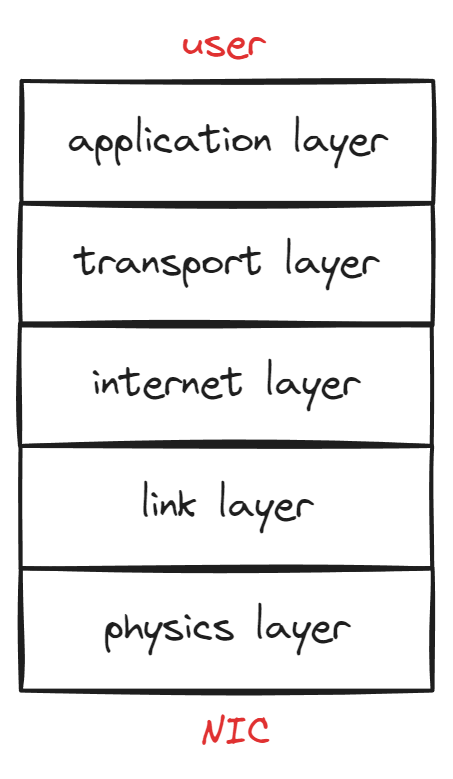
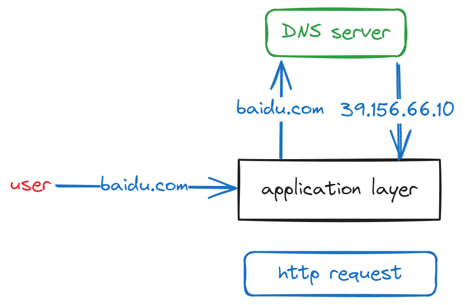
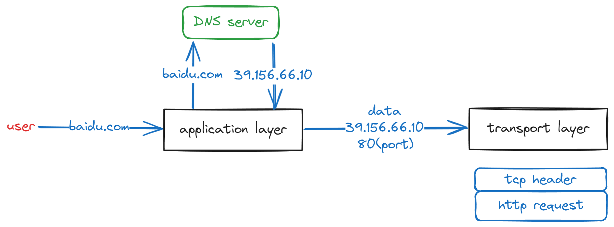
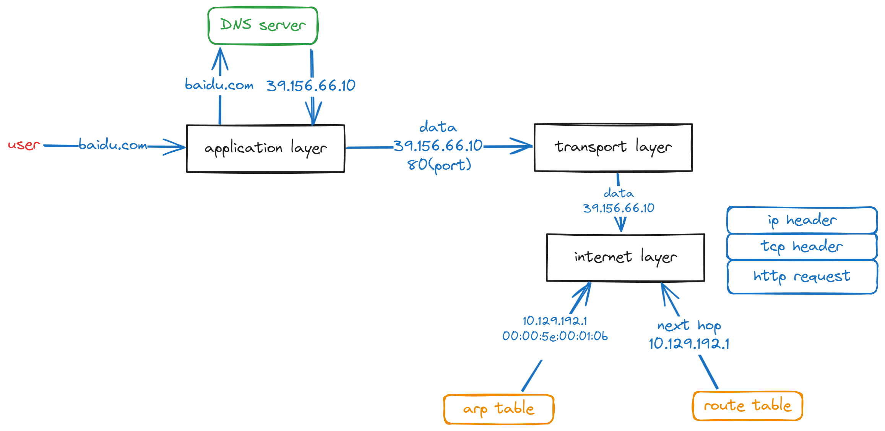
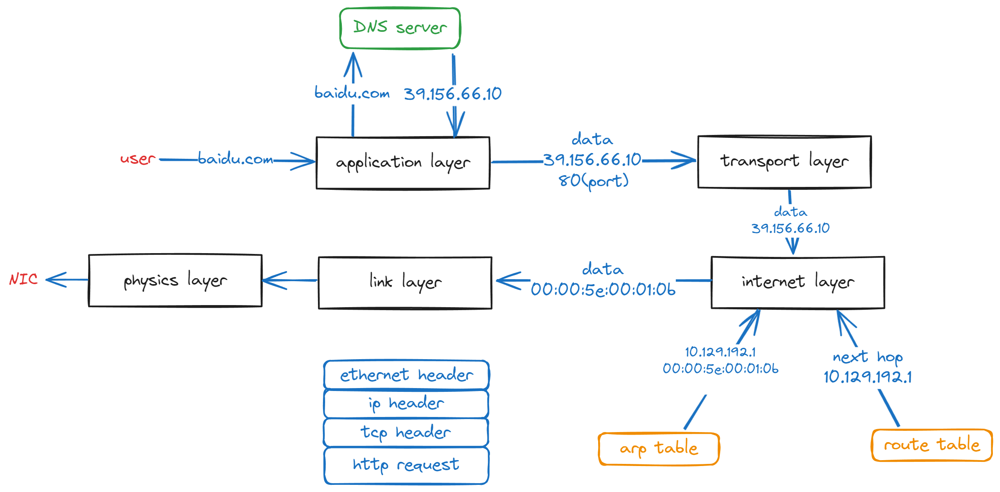
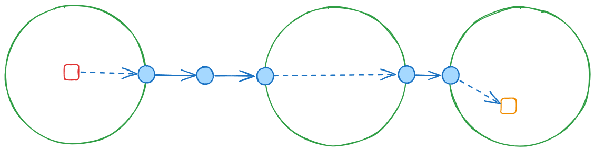

# 网络相关的shell命令

!!! info "info"
    这一页会有比较多的图片，请在网络畅通的环境下浏览本页

经过了前面三章的内容，我们终于结束了初级篇中对文件系统的介绍。网络功能也是操作系统为我们提供的很重要的一项服务，因此接下来我们会开始学习网络相关的`shell`命令。由于网络相关的技术有很多并且它们十分复杂且紧密相连，所以很难在短短的一l两章里面清楚严谨地介绍所有网络相关命令。所以我打算采取这样的方式：首先用尽量简单通俗的方式方式介绍一下当前我们的互联网的模型和其中几个重要概念，然后我依次介绍几个常用的命令中最常用的几个用法。我必须承认，这一章中的其中几个命令，我所介绍的用法只是冰山一角，但是我受限于我的个人水平，篇幅和本文档定位的原因，我无法介绍更多详细的内容。如果经过了我的介绍，你对计算机网络产生了兴趣，推荐你去学习一下计算机网络这门课的相关知识，然后再利用网络或者相关的用户手册(如何查看用户手册将在[第13章]()中介绍)更加深入地学习一下这些命令的使用。
> 这里夹带一个私货，如果你希望系统学习计算机网络，强烈推荐中科大郑烇老师的计算机网络课程。[链接](https://www.bilibili.com/video/BV1JV411t7ow)(Bilibili, BV1JV411t7ow)

## 计算机网络简介(省流版)

### 计算机网络的层次结构
> 计算机领域里没有什么是增加一层抽象解决不了的问题。如果有的话，那就再增加一层。

计算机网络的分层结构可以说是计算机领域里利用抽象解决问题的经典案例。为了解决计算机之间通信互联的问题，经过许多次的技术迭代，计算机网络逐渐形成5层的层次结构(也有的地方把这里划分成4层或者7层)。每一层都提供了计算机网络中需要的某些功能，它们每一层都利用下一层所提供的功能为上一层提供服务。这样，每一层只需要关注于自己需要实现的能力，而不需要关心其他层的具体实现。

### 什么是协议

在计算机网络中，处于核心地位的就是各种协议。上面我们所说的能力，都是靠协议规范的。所谓协议，简单来说就是对某一层中某项功能的具体行为的规定。例如，我们想要有发送电子邮件的能力，相应的协议就规定了什么是电子邮件，要将你的邮件数据以什么样的形式发送出去才能被正确接收到等等。

计算机网络的分层结构中，每一层都有若干功能，每种功能都有至少一个协议来规范。我们的计算机中就有大量的代码(可能是一个程序也可能是某个库)按照协议的要求实现了这些能力，这样我们的计算机才能连接互联网，使用各种网络应用。

计算机网络的这5层结构，从上到下分别是：

1. 应用层(application layer)：应用层提供的是用户直接接触的应用，它给我们提供的能力包括但不限于发送邮件(smtp, icmp, pop3协议)，浏览网页(http, https协议)，上传下载文件(http, https, ftp等协议)。后面我们会学到的一些命令就使用了应用层提供的能力。

2. 传输层(transport layer)：传输层提供的是将数据从一个进程传输到另一个进程的能力。它给应用层的应用提供的能力包括但不限于可靠的数据传输(这里的可靠可以简单理解成在理论上保证发送的数据对方一定能接收到，tcp协议)，不可靠的数据传输(好处是高效，udp协议)。

3. 网络层(internet layer)：网络层提供的是将数据从一台计算机传输到另一台计算机的能力(不保证可靠)。它给传输层提供的能力只有根据ip地址将数据发给对应的计算机(ipv4, ipv6和一些路由选择协议)。

4. 链路层(link layer)：链路层提供的是在一个子网(简单理解就是一个小范围的网络)内，根据mac地址将数据从一台计算机传输到另一台计算机。因为网络层的数据传输通常要经过许多个子网，因此它给网络层提供的能力是在子网内部传递信息(Ethernet II协议等)。

5. 网络层(physics layer)：网络层提供的是将数据通过物理设备(网卡，集线器，交换机等)发送出去和通过物理设备接收到数据的能力。

<figure markdown="span">
    { width=50% }
    <figcaption>计算机网络5层模型的示意图(NIC指网卡)<figcaption>
</figure>

### 计算机网络的简化版模型

这里我将用访问一个网站作为例子，将计算机网络应用是如何运行的进行一个十分简化的介绍。

一般当我们打算访问一个网站的时候，我们首先会打开浏览器，然后在里面输入我们要访问的网站的网址。比如我们想要访问百度的主页。

首先，浏览器会将`baidu.com`发给一个DNS服务器(这里的发送实际上就要从上到下经历那5层结构，但是这里我不打算详细描述因为后面马上会再说一遍这个。)，询问`baidu.com`对应的ip地址。ip地址就是一个网络上设备的地址，根据ip协议，我们利用这个ip地址就能找到对应的服务器。

得到这个ip地址之后，浏览器会将你的访问请求写成http协议的格式(http协议的具体内容在下一章)。到这一步，应用层的任务就完成了。接下来，这请求数据会和ip地址还有端口号一起交给计算机中负责tcp协议的软件(操作系统就提供了这种服务，当然也可以使用普通软件来实现)。

<figure markdown="span">
    { width=60% }
    <figcaption>访问网站的第一步(这里DNS服务画的很简略，下面蓝色框里是当前的数据的样子)<figcaption>
</figure>

刚才我们提到了，传输层的协议可以将数据从进程传输到进程，我们还知道使用ip地址可以定位到一台计算机。那么如何定位到一台计算机上的一个特定的进程呢？使用的就是端口号(port)。端口号是一个16位的无符号数，每个端口号对应着一个进程(不过，一个进程可以同时使用多个端口号)。因此有ip地址和端口号，tcp协议就可以将数据可靠地传输给一个特定的计算机上的一个特定的进程。很有趣的是，同一台计算机上的两个进程也可以使用tcp进行传输数据。这里对于浏览网页来说，http服务器通常都使用80端口。因此这里tcp将ip地址和端口号以及其他必要的信息假如的数据的最开头，称为tcp头(tcp header)的一个部分(使用其他的协议比如UDP就会有UDP头)，然后将打包好的数据和ip地址交给负责ip协议的软件。到这一步，传输层的**主要**任务就完成了。

<figure markdown="span">
    
    <figcaption>访问网站的第二步<figcaption>
</figure>

这里我说主要，是因为tcp协议为了保证可靠传输，首先还要用额外的几次通信建立tcp连接，并且它在发出数据之后要等待对方的确认，对方在收到数据之后要发出确认，如果在一定时间内没有收到确认，根据协议要求，需要重新发送数据。因此这里会涉及很多的技术细节，我就不展开说了。

负责ip协议的软件收到数据之后会根据目标ip地址找到如何将数据传到目标计算机。通常，数据需要经过网络中多个路由器(一种在网络中负责接收和转发数据的设备)的转发才能到达目标。路由选择协议的功能就是告诉我们从我们所在的地方到目标，一条比较好的路径是什么。

路由选择协议通常运行一个最短路算法，然后得到我们自己到网络中每个目标的最短路径怎么走。由于现在世界上的联网设备实在是太多了，所以如果针对每个目标都计算一遍，需要花费很多的计算资源。所以现在的做法是，将一片区域的设备组织成一个子网，比如学校的校园网就是一个子网(子网之间还可以再组成更大的子网)。每个子网对外有一个或几个设备接收发送数据，被称为网关，我们只需要将数据发送到对应的网关，由网关负责将数据发送到子网中的具体设备。

定期运行路由选择算法之后，我们的计算机上会保存一个路由表，里面记载了到达每个目标ip地址的路径中紧接着的下一个设备的ip地址。互联网上的每台设备都会有这样的一个路由表。一般来说，我们的路由表中大部分ip地址的下一跳都是我们所在的子网的某个网关的地址。

根据我们查询到的下一条的ip地址，我们会在我们的设备中查询arp表。这张表记录了我们所在子网内设备的ip地址和它的mac地址的对应。

ip地址是按照ip协议，根据设备所在的子网给他分配的地址。设备移动位置或者重新接入网络的时候，ip地址都很有可能变化。mac地址则是每个网络设备在生产的时候给它的一个固定的地址，是不会发生变化的。

链路层利用mac地址在一个子网中找到网络设备，所以我们必须要知道目标设备的mac地址才能将数据发送到它。但是网络层使用的是ip地址，因此在一个子网内部，使用arp协议来知道某个ip地址的设备的mac地址。这个协议也很简单，就是如果不知道，那就广播一个询问给这个子网内的全部设备，对应ip地址的设备就会将自己的mac地址返回给询问者。询问者就会将这个ip地址和mac地址的对应记录在表中。因为ip地址经常会发生变化，所以arp表的内容如果时间长了就会被清理掉。

知道了mac地址后之后，传输层就会将目标ip地址等信息也加入到数据最开头，ip头(ip header)中，然后将数据和mac地址传给链路层。

<figure markdown="span">
    
    <figcaption>访问网站的第三步<br>根据路由表下一跳是10.129.192.1，这是我们校园网网关的ip地址。<br>根据arp表，这个地址对应的mac地址是00:00:5e:00:01:0b。<figcaption>
</figure>

链路层再将目标mac地址等信息加入到数据最开头，ethernet头中，然后将这个数据传给网卡，网卡将其发送出去。

<figure markdown="span">
    
    <figcaption>访问网站的第四步，数据经过链路层的包装从网卡被发出。<figcaption>
</figure>

数据发送出去之后会经过网关以及互联网上的多个路由器的中转。每次中转，接受的数据的设备都会检查数据中最开始的头部信息。然后数据头部会被扔掉然后向上传递直到到达到达中转设备的网络层。中转设备的网络层会检查ip头中的目标ip，发现不是自己，于是中转设备会知道自己是这条路径中的一跳。然后中转设备会根据路由表找到下一跳，重新包装数据(比如，每一次转发下一跳mac地址都会发生变化)，之后再向下经过链路层和物理层被发送出去。最终数据会到达我们要访问的网站的服务器。

<figure markdown="span">
    
    <figcaption>访问网站的第五步，数据经过多跳之后到达服务器<br>其中红色方块是我们的个人电脑, 蓝色圆圈是网关或者路由器<br>橙色方块是服务器, 绿色圆圈是子网<figcaption>
</figure>

在服务器这一端，首先网卡会接收到数据，然后检查ethernet头发现目标mac地址是自己，就会把数据向上传输给链路层。链路层检查到ethernet头中目标是自己之后，就会将ethernet头扔掉将数据向上传输给网络层。网络层检查ip头中目标ip地址是自己之后，根据ip头中的信息发现这个数据应该由tcp协议处理，就会将ip头扔掉之后向上转发给负责tcp协议的软件。负责tcp协议的软件根据tcp头中的端口号信息，找到对应的进程，将tcp头扔掉之后数据传输给进程。此时，服务器上的相应进程就收到了和浏览器当初发出来的数据完全一样的数据。

进程最终根据http协议的规定，解析数据，发现是一个用户请求网页数据。至此，我们的请求数据终于到达服务器了。之后服务器会经过几乎同样的步骤，将网页数据传输给我们的计算机上的浏览器，浏览器再将网页数据渲染到屏幕上，我们就在浏览器中看到我们访问的网页了。

有必要说明，上面的模型是一个非常简化的模型，并且只是一个例子。例如在链路层使用的不一定是Ethernet II协议，在中间的转发设备上，我们发送的数据可能被切分成多个段等。这里我只是描述了一种比较简单的可能性。

## 查看计算机的网络配置——ip

经过了一个计算机网络的基础知识的速通<del>(确信)</del>之后，我们终于可以开始第一个网络相关的`shell`命令了。`ip`是Linux内核提供的一个用于查看和修改计算机上的网络配置的软件。这个软件功能非常多，但是这里我只介绍查看几种常用的信息的功能。因为这里假设大家都几乎没接触过过多计算机网络的知识，所以不建议大家修改任何配置，因此我也就不介绍使用`ip`修改配置的方式了。

### 查看网络设备

首先要介绍的是查看计算机上全部网络设备和它们的ip地址，mac地址等信息的命令，
```bash
ip address
```
这命令应该会输出很多的信息，它按顺序输出了你的计算机上的所有网络设备的详细信息。类似于这样，
```
1: lo: <LOOPBACK,UP,LOWER_UP> mtu 65536 qdisc noqueue state UNKNOWN group default qlen 1000
    link/loopback 00:00:00:00:00:00 brd 00:00:00:00:00:00
    inet 127.0.0.1/8 scope host lo
       valid_lft forever preferred_lft forever
    inet 10.255.255.254/32 brd 10.255.255.254 scope global lo
       valid_lft forever preferred_lft forever
    inet6 ::1/128 scope host
       valid_lft forever preferred_lft forever
2: eth0: <BROADCAST,MULTICAST,UP,LOWER_UP> mtu 1400 qdisc mq state UP group default qlen 1000
    link/ether f8:9e:94:2b:0b:a6 brd ff:ff:ff:ff:ff:ff
    inet 10.28.252.23/19 brd 10.28.255.255 scope global noprefixroute eth0
       valid_lft forever preferred_lft forever
    inet6 fe80::646f:e118:e019:b419/64 scope link nodad noprefixroute
       valid_lft forever preferred_lft forever
3: loopback0: <BROADCAST,MULTICAST,UP,LOWER_UP> mtu 1500 qdisc mq state UP group default qlen 1000
    link/ether 00:15:5d:02:62:f7 brd ff:ff:ff:ff:ff:ff
4: eth1: <BROADCAST,MULTICAST> mtu 1500 qdisc mq state DOWN group default qlen 1000
    link/ether 5c:60:ba:56:c8:cb brd ff:ff:ff:ff:ff:ff
5: eth2: <BROADCAST,MULTICAST> mtu 1500 qdisc mq state DOWN group default qlen 1000
    link/ether 00:50:56:c0:00:01 brd ff:ff:ff:ff:ff:ff
6: eth3: <BROADCAST,MULTICAST> mtu 1500 qdisc mq state DOWN group default qlen 1000
    link/ether 00:50:56:c0:00:08 brd ff:ff:ff:ff:ff:ff
```
其中，每个序号后面的名称，例如`eth0`，就是网络设备的名称。在每个设备的信息中，跟在`link/ether`后面的形如`f8:9e:94:2b:0b:a6`的就是这个设备的mac地址(注意，不是后面的`ff:ff:ff:ff:ff:ff`)。

其中一些设备的信息中，跟在`inet`后面的形如`10.28.252.23/19`，其中`/`前面的`ipv4`地址，也就是第四代ip地址。用点分隔的每段最大可以是255(十进制)，`/`后面的是子网掩码(不懂的话不用在意)。更在`inet6`后面的形如`fe80::646f:e118:e019:b419/64`，`/`的是`ipv6`地址，也就是第6代ip地址。`/`后面的也是子网掩码。

另外，我们看到全大写的`UP`或者`DOWN`或者`UNKNOW`表示这个设备是否启动。

其他的信息如果你好奇可以自己去查阅相关资料。

如果你希望得到更简略的信息可以使用`--brief`选项
```bash
ip --brief address
```
如果你希望得到更详细的信息可以使用`--detail`/`-d`选项
```bash
ip --detail address
```
这两个选项对于`ip`命令的其他功能也适用。

另外，`ip`命令还可以使用缩写。通常我们把像`ip`命令的`ip address`这样的，使用一个位置参数来表示一个命令的某一项功能的方式成为子命令。`ip`的子命令有很多，这里的`address`是其中之一。对于`ip`这个命令来说，我们可以使用它的子命令的缩写。只要对于某一个子命令，它的某个前缀是独一无二的，那么这个子命令就可以缩写成这个前缀。例如`address`的任何一个前缀都是独一无二的，因此不管是缩写成`ip a`还是`ip ad`还是`ip addr`都可以。

### 查看链路层的信息

使用下面这个命令可以查看链路层相关的信息
```bash
ip link
```
不过你会发现，这个命令输出的信息是`ip address`的子集。

### 查看设备的路由表

使用下面这个命令可以查看设备的路由表
```bash
ip route
```
其中包括目标子网的ip地址和链路下一跳的ip地址，像这条链路发送数据使用的设备的名称，这条链路的代价等信息。但是对于我们的个人电脑来说，路由表中通常只包含从我们自己到我们所在的子网的网关的路由信息，因为我们对外发送的所有网络数据都需要经过网关。其他的路由表项可能是一些特殊的ip地址。

### 查看arp表

使用下面这个命令可以查看设备的arp表
```bash
ip neighbor
```
其中包括了和这个设备直接连接的设备的ip地址和mac地址的对应等信息。同样对我们的个人电脑来说，arp表中的信息通常只包含我们所在的子网的网关的ip地址与mac地址的对应。

## 小结

这一章我们花了很多篇幅介绍了计算机网络的一点基础知识，这些都是重要的前置知识。当然，计算机网络技术内容非常多，远不是这一点点文字就能介绍完的。在这之后，我们介绍了我们的第一个和网络相关的`shell`命令——`ip`，这个命令可以查看我们的计算机上的网络配置和计算机网络5层结构中下面4层的信息。下一章，我们将重点关注我们关系最紧密的应用层，介绍一些应用层的`shell`命令。利用那些命令，我们将会拥有使用计算机网络的能力，我们将使用`shell`命令访问网页，接收发送邮件，从网络上下载文件等等。

<script src="https://giscus.app/client.js"
        data-repo="OshinoShinobu-Chan/Linux-shell-Tutorial"
        data-repo-id="R_kgDONEc4yg"
        data-category="Announcements"
        data-category-id="DIC_kwDONEc4ys4Cj5Fk"
        data-mapping="title"
        data-strict="0"
        data-reactions-enabled="1"
        data-emit-metadata="0"
        data-input-position="top"
        data-theme="preferred_color_scheme"
        data-lang="zh-CN"
        data-loading="lazy"
        crossorigin="anonymous"
        async>
</script>