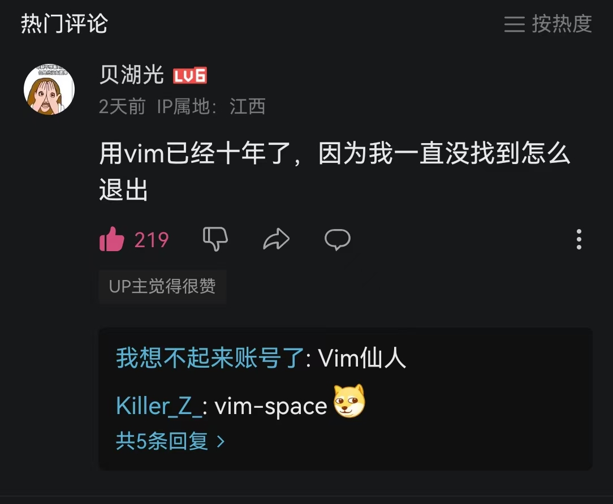

# 更多的文件操作shell命令

## 引言

上一章我们介绍了linux文件系统下如何表示文件路径，然后介绍了什么是pwd。这一章我将介绍更多的文件系统的`shell`命令。这些命令一般都有很多的参数，但是其中很多参数的功能并不常用而且理解起来也完全不困难，我在这里一一介绍的话就太无聊了。因此这里我只会介绍这些命令的常用功能，其他的命令行参数大家可以自己去搜索相关资料。

## 复制文件——cp

文件系统关于文件操作的一个很重要的能力就是复制和移动文件。在有图形界面的文件系统中，我们可以很方便地通过拖动或者用一些快捷键移动和复制文件。但是在`shell`当中，当然是使用指令来完成这些操作。这里我们先介绍用于复制文件的指令`cp`(**c**o**p**y)。

`cp`是GNU coreutils的一个软件，它的作用是将一个或者多个文件或文件夹复制到文件系统中的另一个位置。

### 基础用法

`cp`命令接受在最末尾的**至少两个**位置参数，其中最后一个一定是复制的目标位置，前面都是要复制的文件。例如：
```bash
cp test.txt ./testdir
```
如果你按照文档前面的部分操作的话应该会有这个文件和这个文件夹。这个命令将`text.txt`复制到了`./testdir`，你可以使用`ls`来检验一下，当前文件夹下和`./testdir`是不是都有这个文件了。如果你复制的是文件并且在目标中没有指定文件名，那么`cp`会在目标文件夹下复制一个同名的文件。

你还可试试下面这个命令
```bash
cp test.txt ./testdir/kissshot.txt
```
这个命令也是复制了文件`test.txt`但是因为指定了文件名，所以`test.txt`会被复制到`./testdir/kissshot.txt`这文件中。如果目标文件不存在的话会创建这个文件。

当然，我们也可以同时复制多个文件，但是这样的情况下，目标就必须是一个文件夹了。可以尝试下面这两条命令。
```bash
mkdir testdir2
cp test.txt ./testdir/kissshot.txt ./testdir2
```
你可以自己使用`ls`验证命令的效果。

### 复制文件夹

`cp`也可以复制整个文件夹，这时必须使用选项参数`--recursive`/`-r`/`-R`(这个参数有三种形式)。这个参数也经常会在其他类似的命令中出现，比如下面的`mv`。

### 关于覆盖的行为

需要特别注意，当你使用`cp`复制文件的时候，如果目标位置已经存在同名的文件了，`cp`会直接用新文件将原来的文件覆盖。如果你不是有意这么做的，你可以使用`--interactive`/`-i`参数避免你的错误，这个参数可以让`cp`每次在存在同名文件的时候都询问你是否要覆盖它。另外，`cp`还提供`--update`参数，这参数可以让你更精细地控制哪些文件应当被覆盖，这样既可以防止一些文件被你无意中覆盖了，也可以避免你在复制大量文件的时候，每个都要手动控制是否要覆盖。

`cp`还有很多其他的参数，但都不那么常用，所以这里就不介绍了。

## 移动文件——mv

`mv`和`cp`简直就像是双胞胎一样，在常见的用法上，移动文件和复制文件几乎唯一的区别就是移动文件的时候，原来的文件不会被保留。所以你们可以自己尝试一下，上面`cp`介绍过的基础用法，在`mv`都可以用。`mv`不需要`-r`就可以移动文件夹。关于覆盖的行为，`mv`和`cp`也完全一样。`mv`也是GNU coreutils的一个软件。

### 文件(夹)重命名

使用`mv`还可以做到给文件或者文件夹重命名，这是这个命令稍微有趣一点的用法。但其实你们稍微想一下也很容易能想到。如果我想把现在文件夹下面一个叫`test.txt`的文件重命名为`test`(相当于我们去掉了这个文件的后缀名，这很有趣，请你暂时记着这件事，之后我们还会再讨论一下这个问题)，可以用下面这个命令
```bash
mv test.txt test
```
其实把一个文件移动到当前文件夹下的另一个名字等同于给文件重命名了。文件夹的重命名也类似，但是要记得加上`--recursive`(或者`-r`或者`-R`)。

## 打印文件的内容——cat

这是一个十分重要的命令，它的常用程度在文件系统的操作当中可能仅次于`ls`。`cat`是GNU coreutils的一个软件。它的主要功能就是将一个文件的全部内容打印到屏幕上，相当于是`shell`中打开文件的功能。

### 基础用法

`cat`使用起来也很简单，它接受**至少一个**在最末尾的位置参数，这个参数指明了要打印的文件路径。如果有多个参数的话，这里就是按顺序将所有文件打印到屏幕上。也就是，现在我们终于可以验证一下我们在第二章的时候向文件中写入的东西是不是真的了。使用下面这条命令即可(你是否还记得，上一节里我们用`mv`给它重命名了)
```bash
cat test
```
这条命令应该会把文件内容打印到屏幕上。

### 连接文件

利用`cat`的基础用法我们很容易就能发现`cat`的一个有趣的用法，就是它可以将多个文件直接连接成一个。你可以先用第二章我们讲到过的方式写入两个文件，名称和内容都随便，这里我就用这两个了
```bash
echo "Hello, this is Crimmy. " > hello.txt
echo "I love Shinobu-Chan." > dontmind.txt
```
然后我们就可以使用这个命令将他们连接起来并写入另一个文件(如果你的文件名和我的不一样记得修改一下)
```bash
cat hello.txt dontmind.txt > concated
```
我们仍然可以使用`cat`来验证一下效果。

### 显示行号

如果`cat`的内容是大段的文本，并且有很多行，显示行号会很方便，因此你可以使用选项参数`--number`/`-n`来控制`cat`在输出文本的时候加上行号。另外可以使用`--number-nonblank`/`-b`来让空行跳过编号。

`cat`还有其他的一些功能，但是它们很不常用，主要是用一些特殊记号显示出文本中的换行符制表符之类的。

## 文件类型和文件后缀名

既然前面已经多次提到，那么这里我就暂时打断一下`shell`命令的介绍，先来讲解一下文件类型和文件后缀名的问题。

### 文件类型

在接触到linux系统之前，对于一般人来说，文件类型可能分为文本文档，图片文件，音频文件，视频文件等等。并且这些种类里面可能还会细分各种不同的格式。并且每种文件似乎都会有一种特殊的文件后缀名来区分。文件后缀名就是在文件名的最末尾，以`.`和前面的文件名称分隔的一个特殊字段，例如我们看到`.jpg`就会知道这是一张图片。而且对于熟悉图形化界面文件系统的我们来说，我们很可能会觉得文件后缀名很重要，因为可能有人遇到过因为文件后缀名不正确导致无法正常打开文件的情况，也遇到过因为不能识别的文件后缀名而不能打开文件或者需要麻烦地手动选择打开方式的时候，还有可能遇到过我们尝试或者误触更改了文件后缀名而被操作系统提醒的时候。

但是文件的后缀名真的这么重要吗？

对于在linux系统上运行过一些程序的同学，你们可能已经发现了一件奇怪的事，我们熟悉的windows系统下的可执行文件通常有后缀名`.exe`，但是linux系统下的可执行文件似乎通常没有后缀名。对于没有这样的经历的同学，刚才我们也已经看到了，我们可以轻易地创建一个没有后缀名的文件并往里面写一些文字，我们还可以轻松地使用`cat`将其中的内容读出来。

这一切都让后缀名在linux系统下看上去没那么重要。

实际上，文件的后缀名也确实没那么重要，那些其实主要是给人类看的。在文件系统看来(不只是linux文件系统)，并没有那么多文件类型，我们现在认为的那些文件实际上都是同一种，也就是磁盘上的普通数据块。文本文件，图片，音频，视频都是这一类。文件夹可能稍微特殊一些，但是差别并不大。如果说普通文件和文件夹的亲缘关系像是人类和大猩猩的话，那么对于linux系统下其他种类的文件来说(这里只对于linux系统来说是这样)，普通文件和他们的关系或许更像是人类和香蕉的关系。但是这些文件类型也并不需要linux系统使用文件后缀名来区分，一方面是不同种类文件的差别实在是太大，他们互相之间不会干扰，另一方面，linux系统内部当然也记录了这些文件的类型，也有系统调用可以对这不同文件类型进行区分。

### 获取文件信息——stat

如果你还记得我在第二章的时候说过的内容，`shell`就是将linux的系统调用提供给我们人类的，那么我们很自然地就会想到，是否有`shell`命令可以查看文件的类型信息呢？当然有，这就是`stat`命令，基础用法就是后面接要查看的文件的路径。它不只有文件的类型信息，还有很多其他信息，这里我也顺便粗略介绍一下，会涉及一些操作系统的知识，不感兴趣或者因为缺乏一些前置知识而觉得太困难的同学可以只关注一下文件类型，然后跳过这一部分的其他内容。

首先，我们用`touch`命令在文件夹下创建一个空文件，这时(根据这个文档前面的操作)，你至少知道一个非空文件的路径，知道一个空文件的路径和一个文件夹的路径，那么你请使用指令分别查看一下它们的信息。最后你可以用如下指令来查看一下linux文件系统下`/dev/null`这个特殊文件的信息。
```bash 
stat /dev/null
```

上面你应该至少查看了四个文件的信息，每个文件信息都应该是类似下面这样形式的输出
```
  File: ./dir1/test2
  Size: 0               Blocks: 0          IO Block: 4096   regular empty file
Device: 8,32    Inode: 1428611     Links: 1
Access: (0644/-rw-r--r--)  Uid: (    0/    root)   Gid: (    0/    root)
Access: 2024-10-31 23:50:02.898005975 +0800
Modify: 2024-10-31 23:50:02.898005975 +0800
Change: 2024-10-31 23:50:02.898005975 +0800
Birth: 2024-10-31 23:50:02.898005975 +0800
```
首先，我们先关注右上角的文件类型信息，示例中的这个文件是一个常规空文件(regular empty file)，刚才我们查看过的四个文件的类型应该各不相同，除了这哥类型以外应该还有常规文件(regular file)，文件夹(directory)，和字符特殊文件(character special file)。除了最后一种文件以外，另外的文件类型我们都熟悉，最后一种文件会在[第14章]()中详细讲到。linux系统中的文件不止这几种，其他的文件类型我们会在这个文档的后面逐渐涉及。

接下来让我们依次来看一看这些信息，其中有很多我们熟悉的面孔，比如Links是指这文件的硬链接数量，每个文件都至少有一个硬链接，Access是指文件权限的相关信息，这个在讲`ls`的时候详细讲过，Access后面的是Uid和Gid分别指文件的所有者和他的Userid，以及文件所有者所在的用户组和这个用户组的Groupid。最下面的四排则是四个时间戳，分别表示最后一次接触时间(Access，也就是读或执行)，最后一次修改时间(Modify，也就是写)，最后一次更改时间(Change，也就是修改文件的信息，比如更改文件的权限等，**而不是**文件的内容)，以及创建时间(Birth)。

前面还有一些我们看名称就能很容易猜到的信息，比如：Device指的是这文件所在的设备的编号，在特殊文件的信息当中我们还能见到Device type，指的是这文件所在的设备类型，一般也是用一个数字表示的，每个数字代表一种设备。

最后我们还能看到几个不知道什么意思的项，我简单解释一下：
- Blocks: 是指文件所占的块个数。对于一般的磁盘文件来说，磁盘中数据存储的最小单位是块，也就是一个文件必须占整数个磁盘块，最后一个块剩余的空间一般只能闲置。一般来说一个磁盘块的大小是512字节。
- IO Block: 是指文件系统对这个文件每次读写的块大小。因为磁盘操作对于计算机中其他的部分的操作来说比较慢，因此为了节约时间必须尽可能地减少磁盘操作的数量。因此，文件系统一般会以块为单位(注意，这个块跟磁盘块不是一个块)进行磁盘读写操作，每次根据需要读若干块缓存在系统内存中，写的时候也先在内存中写，再按块为单位写到磁盘上。这里的例子就是指文件系统对这个文件的读写以每块4096字节为单位进行。
- Inode: 简单来说是指文件在操作系统中的编号。操作系统在根据文件路径查找文件的时候会按这个路径依次查看每个文件夹，文件夹里面记录了这个文件夹下的每个文件的名称和Inode号的对应。文件系统(别忘了文件系统是操作系统内核的一个部分)中还存储着每个Inode和磁盘具体位置(一般用磁盘的逻辑块号来表示)的对应，这样就能根据Inode号，找到想要的文件或者文件夹在磁盘上的位置。

### 文件后缀名

到这里，这一节的重点——文件类型，已经基本讲完了。最后我们再来讨论一下文件后缀名，以及文件是如何被打开的。之前我们讲到，对于文件系统来说，我们常见的文件基本都是常规文件，它们本质上都是磁盘上的数据块。那么文件是怎么被打开的呢？这是因为在计算机看来没有意义的数据，被人类通过某种规则解释了有意义的数据。例如一堆01的组合可以根据ascii码规则或者unicode规则被人类解释成文字。

一般来说，大部分文件都会在文件最开始的一些字节里面存储一些文件类型信息(这里的文件类型指的是对于人类来说的文件的类型，音频、视频什么的，后面也一样)，文件大小之类的信息，被称为元信息。软件在打开一个文件的时候会首先试图读取这些元信息，不同类型的文件元信息的存储规则不同，如果使用了错误软件就会无法解释这些元信息从而无法打开或者导致打开错误。在`shell`中我们需要用合适的软件打开文件才能获得有意义的东西。比如你有一个`jpeg`格式的图片文件，但是你一定要用`cat`打开，那么你得到的也只能是在屏幕上的一大堆乱码。如果你使用的是Mac OS或者linux虚拟机，那么你在某个文件夹下下面准备一个图片(或者其他的什么不是文本的文件就行)，然后用`cat`打开试试。
> 如果你使用的是WSL，那么也有尝试的途径，在`/mnt`文件夹下挂载着你的Windows电脑的盘符，你可以通过这种途径直接访问你的Windows下的文件，当然也可以使用`cp`，`mv`以及`cat`。例如：`cat /mnt/d/pic/1.jpg`可以打开你的D盘下的`pic`文件文件夹里面的`1.jpg`这个文件。

因此在`shell`下，后缀名完全是给用户看的，用户可以根据文件的后缀名推断这个文件应该用什么软件打开。

在有图形界面的情况下(当然包括有图形界面的linux系统)，我们可以直接双击使用合适的软件打开一个文件。对于Windows操作系统来说，它就是通过文件的后缀名自动推断的。

当然，`bash`当中也有命令可以自动推断文件类型并选择合适的软件来打开这个文件。这个命令就是`xdg-open`，这是linux桌面环境自带的一个软件，你在linux的图形化界面上双击一个文件，linux的桌面环境就是使用这个软件或者类似的软件自动推断文件类型并选择合适的软件打开。使用这个命令只需要在后面接一个位置参数，这个参数可以是文件路径，表示打开这个路径下的文件，也可以是一个`url`(简单理解就是网址)，表示使用默认浏览器打开这个`url`。但是，如果你使用的WSL，那么你很可能会发现用它打开大部分非文本文件都会失败，这是因为WSL中的桌面环境很不完整，几乎没有图形化的软件可以用，打开图像、音视频文件或者浏览器当然是没有的。

## 查看文件的内容——view

我们虽然可以使用`cat`将一个文件的全部内容打印到屏幕上然后查看，但是这还有一些不方便，比如，文件内容太长的时候需要翻很久才能看到文件开头，在查看代码的时候没有语法高亮等。这时就可以使用`view`命令了。但实际上这命令不是一个单独的软件，而是另一个功能强大但是使用门槛比较高的文本编辑软件`vim`的只读模式。本文档会在[第16章]()简单介绍`vim`。这里就只讲一下最基础的用法，`view`后面接一个位置参数，表示要打开的文件的路径。为了展示语法高亮，你可以选择你喜欢的语言，然后使用`echo`的方式向文件中写入一个最简单的程序，并使用`view`打开试试看。
> 嘿嘿，是不是发现自己不知道应该如何退出这个界面了。这是我开的一点小玩笑，但是如果你去搜索引擎上搜索，你会发现不止你一个人不知道如何从`vim`中退出。这问题现在已经几乎成为一个梗了。实际上，退出的方式是先输入`:q`，然后按回车。(注意不要按到其他的键哦, 否则会发生什么我就不知道了)
<figure markdown="span">
  { width="45%" , align=left}
  { width="45%" , align=right}
</figure>

## 删除文件——rm

!!! danger "Danger"
    这条命令十分危险，请谨慎操作。这不是演习！这条指令十分危险，请谨慎操作！！！

删除文件也应当是文件系统应该拥有的能力，但是与Windows不同的是，linux `shell`中没有回收站这个概念。因此只需要短短一条命令，你要删除的文件真的就永久地消失了。因此这一节的内容在实践的时候务必十分谨慎。

删除文件的命令就是`rm`，也是GNU coreutils的一个软件。
> 尤其对于使用WSL同学，因为WSL默认在`root`用户下，因此你们拥有系统的最高权限，可以删除系统中任何的文件。
>
>不过另一方面，使用WSL或者虚拟机的同学，你们也有一个好处，就是当你们不小心删掉了重要的系统文件导致linux系统无法正常使用的时候，重新安装一个新的WSL或者虚拟机就行了。~~(玩坏了就扔掉是吧，好糟糕)~~

> 对于那些不是`root`的用户，在使用`rm`的时候可能会因为权限不足被拒绝。如果你确认你明白你在做什么的话，可以在指令的最前面加上`sudo`(注意要有空格，因为后面的内容相当于`sudo`的参数)，暂时拥有更高权限。第一次使用这个命令会弹出警告，并且需要输入安装系统的时候设置的密码。输入密码的时候密码并不会显示在窗口中，因此你只需要输入完按回车就行。如果密码正确，这条命令就会被执行。

### 基础用法

`rm`命令接受**至少一个**在最末尾的位置参数，表示要删除的文件的路径。可以先使用前面介绍过的方式创建一个文件，比如`miku`，然后使用下面这个命令(你可以先用`ls`验证一下是否创建成功了)
```bash
rm miku
```
然后你可以再使用`ls`验证`rm`的效果。~~(什么？miku？她从没存在过啊)~~我们就这样毫无声息的永久删除了一个文件。

### 有提示的删除

如果你想在每次删除的时候都获得提示以免误删了你本来不想删除的东西的话，可以使用`-i`选项。加上这参数之后，每删除一个文件，`rm`都会询问你是否要删除。只有输入`y`或者`yes`然后按回车才会删除，直接回车或者按其他的东西都会让`rm`跳过这个文件而不删除它。

当然，使用`-i`有个问题，就是如果你想一次删除一大批文件，如果每次都确认就太麻烦了。还有`-I`参数可以选择，它会在每次删除的文件数目大于3或者你删除的内容中包含文件夹的时候询问你一次，它可以一定程度上避免你犯错误。

### 安静地删除

现在你可以尝试一下删除一个文件夹中不存在的文件。你会发现`rm`会提示你这个文件不存在。当你删除一大批文件而其中包含不少文件不存在的时候，`rm`就会给出大量这样的错误信息，有的时候这些信息会将我们想看的信息挤掉。这个时候就可以使用`force`/`-f`选项，这会让`rm`不输出任何信息。这个选项和前面的`-i`/`-I`是冲突的，因此放在后面的选项会覆盖前面的选项的效果。你可以试试下面两条指令的不同
```bash
rm -fi miku
```
```bash
rm -if miku
```

### 删除文件夹

和上面的`cp`以及`mv`类似，如果你想用`rm`删除一个文件夹的话，也是使用`--recursive`/`-r`/`-R`选项。你可以创建一个文件夹，还可以在这个文件夹下面创建一些文件，然后使用`-r`删掉它们。

### 危险的命令

介绍完上面这些`rm`的常见用法之后，有必要再向大家展示一下`rm`命令的危险性(这一点我是有惨痛教训的，下面我会讲到)。

就在上面我介绍过的这些参数当中，有两个参数组合起来就能爆发巨大的威力。它们就是`-r`和`-f`，合起来可以缩写为`-rf`。如果你对`rm`使用这两个参数，在权限足够的情况下，可以毫无提示地删除掉任何文件。另外根据我们学过的linux的文件系统的结构，系统中全部文件实际上都存在于`/`根目录这一个文件夹下，因此我们可以得到这样的一个对于linux系统来说威力堪比核弹的命令。
!!! danger "danger"
    不要尝试下面这个命令。如果一定要尝试，请你安装一个全新的虚拟机，在其中尝试。
```bash
rm -rf /
```

我本人就在做操作系统lab的时候经受过随意使用`-rf`选项的惨痛教训。因为虽然`-rf`比较危险，但是它相当方便，可以删除掉任何文件，而且不需要确认，因此我当时习惯于删除文件直接使用`-rf`选项。并且我的lab代码使用`git`系统管理。

这里给不知道`git`是什么的同学简单介绍一下，`git`是一个版本管理软件，也就是它可以记录你的代码任何历史版本，这样在你发生错误的时候可以很方便地退回到某个历史版本中，简单来说就是可以很方便地撤销你对代码做的任何操作。`git`实现这个功能的方式，简单来说就是将你的所有历史版本都以某种方式存储在项目文件夹下的`.git`文件夹中，回退或者切换到历史版本的时候就是将这个文件夹下相应的历史版本拿出来。

我当时想，如果不小心误删了文件也没关系，回退一下版本就好了。另外，因为是lab的原因，所以我没有把我的代码放到github仓库中，所以整个项目没有其他备份。并且习惯使用`fish`，在第二章的时候我提到过，这个`shell`会自动进行命令的提示，并且使用方向键右键就可以很方便地把它的提示填入。这里大家可能已经意识到，buff叠满了。

因为上述全部因素的叠加，我在项目的上一级目中使用`rm -rf`的时候，`fish`给我提示的是这个项目的文件夹，我也没过多思考就习惯性地点击方向键右键和回车了。没有任何提示地，一瞬间，整个项目文件夹都消失了。甚至连使用`git`系统回退的机会都没有了，因为`.git`文件夹也在项目文件夹下。我的lab代码就这样全部消失了。

当然，后来结局还不算太差，这个件事发生在lab2刚结束不久，距离下一个lab的提交时间还比较久。但是lab3是需要在lab2的基础上完成的，所以我花了一些时间完全重新写了一遍lab2的代码，然后又重新写了lab3。最后还是赶上了lab3的提交。并且因为之前lab3的原本代码已经在向屎山的方向发展了，所以我就借此机会重新设计了一下lab3的代码结构，反而比之前做的更好了。这也算是"塞翁失马，焉知非福"了吧。

不过如果你们不想经历像我一样的事的话，一定要慎用`-rf`选项，并且对你的代码做好备份。

## 更彻底地删除文件——shred

### 操作系统如何删除文件

这个问题看上去很简单：把磁盘上对应位置的数据全部恢复成初始状态不就行了吗？但是文件系统通常并不会这么做。这是因为磁盘操作比较慢，所以文件系统在从磁盘上删除文件的时候并不会立即将文件在磁盘上的位置全部写成0。如果这样做的话，文件系统在删除文件的时候会变得很慢。那么文件系统是怎么做的呢？

前面我们说到，文件系统会记录每个文件在磁盘上的位置与它的Inode号的对应关系，并且文件都存在于文件夹中，所以文件的Inode号会被记录在某个文件夹中，另外会有一个文件专门用于记录磁盘上哪些位置是已经被分配出去的。因此当文件系统删除一个文件的时候，只需要将这个文件在磁盘上的位置记录删除，在文件夹中把它的记录删除，并标记这个文件所在的磁盘位置是可用的。这样，我们就无法找到这个文件的记录，也无法在文件夹里面看到这个文件，并且它原本占据的位置可以被重新分配给其他的新文件了(一般来说磁盘上的数据会在重新被分配出去的时候再恢复成初始状态)。这样，这文件就被认为是被删除了。

对于普通用户来说，这样做没什么问题，并且效率还很高。但是这样就存在一个问题，这个文件的数据实际上在删除之后的一段时间内还存在于磁盘上。假设这样一种场景，你的磁盘上的某个文件中存在一些永远不希望被人知道的敏感数据，你从磁盘上删除了这个文件，但是很快，这个磁盘被人抢走了。因为文件的数据还存在于磁盘上，因此实际上你的敏感数据是有办法被重新读出来的。这会带来一些安全性问题。

这时，`shred`为我们提供了一种更彻底地删除文件的方式。`shred`是GNU coreutils的一个软件，它的主要作用是用其他数据完全覆盖一个文件的内容，让文件恢复变得几乎不可能，并且你可以选择在覆写之后删除这个文件。因为`shred`对于普通人来说用的并不多，所以我这里只简单介绍一下它的基础用法，更多用法有需要的可以自己去查阅相关资料。

### 基础用法

`shred`后面接至少一个位置参数，表示要覆盖的文件的路径。还有一些可选参数，比如`-n`/`--iteration=N`，可以让软件覆写`N`次文件，默认值是3次，`z`/`--zero`可以让软件覆写文件之后，再将文件数据覆写成全0。

## 删除文件夹——rmdir

`rmdir`是GNU coreutils的一个软件，这个软件的功能十分简单，就是删除空文件夹，它和`rm`在使用`-rd`的表现类似。如果删除的文件夹非空就会失败。它可以接受至少一个位置参数，表示要删除的文件夹的路径。使用`--ignore-fail-on-non-empty`(好长的参数)可以让它忽略非空的文件夹。`--parent`/`-p`文件夹可以一并删除你的目标文件夹的上一级文件夹，如果它也非空的话。

## 写入文件的另一种方式——tee

`tee`是GNU coreutils的一个软件，它的功能很简单，就是将输入的数据写入文件但同时也会显示到屏幕上。

### 基础用法

`tee`接受一个位置参数，表示要写入的文件的路径。你可以尝试下面这个命令
```bash
tee testtee.txt
```
然后你可以尝试输入一些内容，你会发现每次你回车的时候，你输入的内容就会在屏幕上再被打印一次，同时这些数据会被写入文件中。如果你想要结束输入，按Ctrl-D，表示输入一个文件终止符(这个的具体内容会在下一章讲到)。你可以使用`cat`来检验一下文件内容。

`tee`在写入的时候默认覆盖文件的原有内容，如果你想要向文件末尾插入新内容，可以使用`-a`/`--append`选项。

`tee`和之前我们使用的那种写入文件的方式的主要不同是，它在写入文件的时候还同时将文件内容打印到屏幕上。这看上去很普通，但是下一章我们会讲到，打印到屏幕上实际上将这个文件输入的标准输出流，实际上也就代表着这个文件我们还可以使用管道或者输入输出重定向的方式继续在其他命令中使用。这个功能十分强大，因此我们会在下一章合适的时候再次回到这个现在看上去很不起眼的命令。

## 小结

这一章主要介绍了一系列和文件操作有关的`shell`命令，顺便穿插介绍了文件系统中的文件信息和文件类型有关的内容。这一章的内容你可能觉得过于简单或者过于无趣了，因为这一章只是一堆命令用法的堆叠。但是这只是一章过渡和铺垫，下一章将是初级篇有关文件系统的内容最后一章，会介绍标准输入输出流，输入输出重定向，管道等文件系统和`shell`中的重要概念。这些概念将会让你拥有把这一章和之前章节中介绍的命令组合起来使用的能力。这样我们就可以完成一些更加复杂的工作了。

<script src="https://giscus.app/client.js"
        data-repo="OshinoShinobu-Chan/Linux-shell-Tutorial"
        data-repo-id="R_kgDONEc4yg"
        data-category="Announcements"
        data-category-id="DIC_kwDONEc4ys4Cj5Fk"
        data-mapping="title"
        data-strict="0"
        data-reactions-enabled="1"
        data-emit-metadata="0"
        data-input-position="top"
        data-theme="preferred_color_scheme"
        data-lang="zh-CN"
        data-loading="lazy"
        crossorigin="anonymous"
        async>
</script>